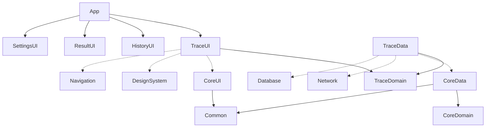

<p align="center">
  
  
  
  
</p>

<h1 align="center">TrueLoss</h1>
<p align="center">
  <b>Profesyonel Network Loss Analizi</b><br/>
  <code>tm.true.loss</code> • Domain / IP • ICMP / UDP / TCP • IPv4 / IPv6
</p>

<p align="center">
  <a href="https://github.com/akhallabs/TrueLoss/actions"></a>
  
  
  
  
</p>

---

### Nedir?

TrueLoss, her hop için **gerçek packet loss**'u ölçen, **canlı RTT grafiği** ve **ASN / ülke / şehir** bilgisiyle profesyonel traceroute deneyimi sunar. Karanlık mavimsi Material 3 Expressive teması, gauge ve sparkline grafiklerle kayıp anında görülür.

> Tek ekranda: Hedef → Protokol → Sonuç → Paylaş

---

### ✨ Özellikler

|  | Detay |
|---|---|
| **Hedef** | Domain veya IP, anında validasyon |
| **Protokol** | ICMP • UDP • TCP (FilterChip) |
| **IP Versiyon** | IPv4 / IPv6 |
| **Canlı Loss %** | Her hop için % — gauge + progress (yeşil → sarı → turuncu → kırmızı) |
| **RTT Grafiği** | Canvas sparkline, min/max, nokta vurgusu |
| **Hop Detayı** | IP, hostname, 3 RTT örneği, ASN, ülke/şehir, timeout tespiti |
| **Özet Hero** | Ortalama & maksimum loss, hop sayısı, protokol — animasyonlu arc |
| **Geçmiş** | Önceki testler, sil/temizle |
| **Paylaş** | Sonucu görsel olarak paylaş |
| **Tema** | Mavimsi M3 Expressive — light/dark, tonal surface, dynamicColor opsiyonel |

---

### 📸 Ekranlar

| Kontrol | Sonuç | Grafik |
|---|---|---|
| Input + Chip + CTA | Gauge + Hop listesi | RTT sparkline |
| *`OutlinedTextField` 28dp* | *`primaryContainer` hero* | *Canvas Path* |

> `feature/trace/ui/TraceScreen.kt` — tamamen Material 3 bileşenleriyle (ElevatedCard, FilterChip, AssistChip, NavigationBar)

---

### 🎨 Tasarım Sistemi

**Seed:** `#0A84FF` → HCT tonal palet → 26+ color role

```
Light: primary #0A84FF / container #D4E4FF / surface #F8FAFF / surfaceContainer #ECEFF7
Dark:  primary #9ECAFF / container #00497D / surface #0B0E14 / surfaceContainer #151A23
Loss:  none #2E7D32 / low #F9A825 / medium #EF6C00 / high #C62828
```

- **Typography:** Roboto 15 stil (`displayLarge 57/64` → `labelSmall 11/16`) — `core/designsystem/theme/Type.kt`
- **Shape:** `xs 4 / small 8 / medium 12 / large 16 / xl 28` — kartlar `large/xl`, input `large`, gauge `CircleShape`
- **Elevation:** tonal overlay `0,1,3,6,8,12dp` — `surfaceContainerLow → Highest`
- **Theme:** `TrueLossTheme(darkTheme, dynamicColor)` — `MaterialTheme(colorScheme, typography, shapes)` tek sarmalayıcı

---

### 🏗️ Mimari

Clean Architecture + MVI + multi-module — **derleyici bağımlılık kurallarını zorlar**



**Kural:**
- `feature:ui` → `feature:domain` + `core:ui/designsystem/navigation` — `data`'yı göremez
- `feature:data` → `feature:domain` + `core:data/network/database`
- `core:*` asla `feature:*`'a bağımlı değil
- `app` tek composition root

```
TrueLoss/
├── app/                          MainActivity, TrueLossNavHost, Hilt
├── core/
│   ├── common/                   Result<T>, Dispatcher, FlowExt
│   ├── domain/                   HopModel, TraceModel, UseCase
│   ├── ui/                       BaseViewModel<State,Event,Effect>
│   ├── designsystem/             Color.kt / Shape.kt / Type.kt / Theme.kt
│   ├── navigation/               Route
│   ├── network/                  Retrofit • OkHttp
│   ├── database/                 Room + TraceEntity
│   ├── datastore/                DataStore
│   └── data/                     aggregator
├── feature/
│   ├── trace/{domain,data,ui}    StartTraceUseCase • TraceScreen + gauge + graph
│   ├── history/{domain,data,ui}
│   ├── result/{domain,data,ui}
│   └── settings/{domain,data,ui}
└── build-logic/convention/       tm.trueloss.* convention plugins
```

---

### 🛠️ Teknoloji

| Katman | Stack |
|---|---|
| Dil | Kotlin 2.0.21 |
| UI | Jetpack Compose BOM 2025.09, Material3 Expressive, Navigation Compose 2.8.4 |
| DI | Hilt 2.52 + KSP |
| Async | Coroutines 1.9 + Flow |
| Network | Retrofit 2.11 + OkHttp 4.12 + kotlinx.serialization |
| Lokal | Room 2.6.1 + DataStore 1.1.1 |
| Build | AGP 8.7.3, Gradle 8.10, Version Catalog, Convention Plugins |

---

### 🚀 Kurulum

```bash
git clone https://github.com/akhallabs/TrueLoss.git
cd TrueLoss
./gradlew assembleDebug
# APK: app/build/outputs/apk/debug/app-debug.apk  (armv7)
```

GitHub Actions her push'ta otomatik derler: `.github/workflows/android.yml` → **TrueLoss-armv7-debug** artifact.

**Gereksinim:** JDK 17, Android SDK 35

---

### 📦 Paket

- **applicationId:** `tm.true.loss`
- **App adı:** TrueLoss
- **Namespace:** `tm.true.loss`
- **ABI:** `armeabi-v7a` (`ndk.abiFilters` + `splits`)

---

<p align="center">
  <sub>Built with Material 3 Expressive • Clean Architecture • Hilt • Coroutines</sub>
</p>
